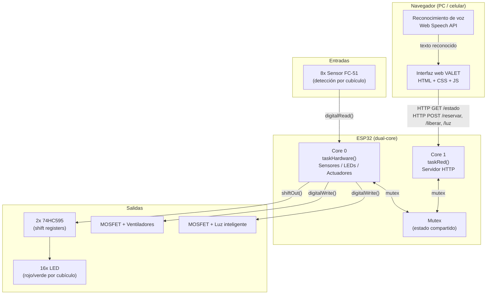

# Parqueadero Inteligente — VALET

**Universidad Militar Nueva Granada**
Facultad de Ingeniería · Ingeniería Mecatrónica
Asignatura: Microcontroladores — Parcial

---

## Descripción general

Sistema de parqueadero inteligente para 8 cubículos (escala Hot Wheels 1:64), construido sobre un microcontrolador **ESP32**, con detección de ocupación por sensores infrarrojos, señalización visual por semáforo LED (rojo/verde) por cubículo, control automático de refrigeración, control de iluminación por comando de voz, y una interfaz web de control llamada **VALET**, que permite consultar el estado del parqueadero y ejecutar acciones (encender/apagar luces, reservar y liberar cubículos) mediante clic o reconocimiento de voz.

---

## a) Repositorio y explicación del código

### Estructura del repositorio

```
parqueadero-inteligente/
├── firmware/                  Firmware del ESP32 (PlatformIO + Arduino framework)
│   ├── platformio.ini         Configuración del proyecto y dependencias
│   ├── include/
│   │   ├── config.h            Credenciales WiFi y mapeo de pines (no versionado)
│   │   └── config.example.h    Plantilla de configuración (sí versionada)
│   └── src/
│       └── main.cpp            Código fuente principal
│
├── webapp/                    Interfaz web VALET (HTML/CSS/JS)
│   ├── index.html
│   ├── css/style.css
│   └── js/app.js
│
├── wokwi/                     Proyecto de simulación (ver sección Simulación)
│   ├── sketch.ino
│   └── diagram.json
│
├── Evidencia/                 Fotografías de la maqueta, interfaz y simulación
├── README.md
└── .gitignore
```

### Organización del código (`main.cpp`)

El firmware se divide en bloques funcionales, cada uno documentado con comentarios en el propio archivo:

| Bloque | Responsabilidad |
|---|---|
| Configuración y pines | Constantes de `config.h`: SSID, contraseña, pines de sensores, actuadores y shift registers |
| Máquina de estados de cubículos | `enum EstadoCubiculo` (`LIBRE`, `RESERVADO`, `OCUPADO`) y sus reglas de transición |
| Lectura de sensores | `leerSensores()` — lee los 8 FC-51 y aplica las reglas de transición de estado |
| Control de salidas | `armarByteLeds()` / `actualizarLeds()` — arma y envía los bytes hacia los dos 74HC595 |
| Actuadores | `controlarVentilador()`, `encenderLuz()` / `apagarLuz()` |
| Servidor HTTP | `handleEstado()`, `handleReservar()`, `handleLiberar()`, `handleReservarTodos()`, `handleLiberarTodos()`, `handleLuzOn()` / `handleLuzOff()` |
| Concurrencia | Mutex (`mutexEstado`) que protege las variables compartidas entre las dos tareas de FreeRTOS |
| Tareas de FreeRTOS | `taskHardware()` (Core 0) y `taskRed()` (Core 1) — ver sección Arquitectura |

El código de `webapp/js/app.js` sigue el mismo criterio de separación: una capa de comunicación con el ESP32 (`fetch` a los endpoints HTTP), una capa de reconocimiento de voz (Web Speech API) y una capa de actualización de interfaz (DOM).

---

## b) Desarrollo funcional de la maqueta

La maqueta física reproduce un parqueadero de 8 cubículos, distribuidos en 2 filas de 4 enfrentadas con pasillo central, sin techar (para exponer el funcionamiento electrónico), demarcado y pintado, con tope y ventana de sensor en cada cubículo. La electrónica de control (ESP32, protoboards, shift registers) queda visible en una franja lateral de la base.

Fotografías de la maqueta terminada: [`Evidencia/Maqueta.jpeg`](Evidencia/Maqueta.jpeg), [`Evidencia/Maqueta01.jpeg`](Evidencia/Maqueta01.jpeg)

### Componentes electrónicos instalados

| Componente | Cantidad | Función |
|---|---|---|
| ESP32 DevKit V1 | 1 | Controlador principal |
| Sensor IR FC-51 | 8 | Detección de ocupación por cubículo |
| Shift register 74HC595 | 2 | Control de los 16 LEDs indicadores con solo 3 pines del ESP32 |
| LED rojo/verde | 8 pares | Semáforo de estado por cubículo |
| LED blanco | 8 | Luz inteligente del parqueadero |
| MOSFET IRLZ44N | 2 | Conmutación de ventiladores y de la luz inteligente |
| Ventilador 5V | 2 | Simulación de refrigeración del parqueadero |

---

## c) Explicación del funcionamiento

### Máquina de estados por cubículo

Cada uno de los 8 cubículos puede estar en tres estados:

```
   LIBRE ──(reserva vía web/voz)──▶ RESERVADO
     ▲                                  │
     │                          (sensor detecta carro)
     │                                  ▼
     └────(sensor deja de detectar)── OCUPADO
```

- **LIBRE**: LED verde. Sin reserva y sin carro detectado.
- **RESERVADO**: LED rojo. Alguien apartó el cubículo desde la web o por voz, pero el sensor aún no detecta un carro físico.
- **OCUPADO**: LED rojo. El sensor detecta un carro (haya sido reservado antes o no).

Visualmente `RESERVADO` y `OCUPADO` se ven igual (LED rojo, "no disponible"); la diferencia es lógica y se refleja en la interfaz web y en el estado reportado por el servidor.

### Refrigeración automática

El sistema cuenta los cubículos en estado **OCUPADO real** (con carro físico detectado, sin incluir reservas) y enciende el ventilador cuando ese número alcanza el umbral configurado (4 de 8). Una reserva sin carro físico no activa la refrigeración, ya que no representa una carga térmica real.

### Control de voz e interfaz web (VALET)

La página web `webapp/index.html` consulta el estado del ESP32 cada 2 segundos vía `GET /estado` y actualiza el mapa de cubículos, los contadores de libres/ocupados y el estado de ventilador y luz. El asistente de voz usa la Web Speech API del navegador para reconocer comandos como:

- *"Valet, enciende las luces"* / *"Valet, apaga las luces"*
- *"Valet, reserva el cubículo 3"* / *"Valet, libera el cubículo 3"*
- *"Valet, reserva los cubículos 2, 4 y 6"* (múltiples a la vez)
- *"Valet, reserva todos"* / *"Valet, libera todos"*

Cada comando se traduce en una petición HTTP (`POST`) al ESP32, que ejecuta la acción y responde con el nuevo estado.

Captura de la interfaz: [`Evidencia/Interfaz.jpeg`](Evidencia/Interfaz.jpeg)

---

## d) Arquitectura

### Diagrama de bloques



### Análisis de la estructura

**Concurrencia (FreeRTOS):** el firmware usa las dos tareas nativas del ESP32, ancladas a núcleos distintos con `xTaskCreatePinnedToCore()`:

- **Core 0 — `taskHardware()`**: lectura de sensores, actualización de LEDs, control de actuadores. Ciclo cada 500 ms.
- **Core 1 — `taskRed()`**: atiende el servidor HTTP (`servidor.handleClient()`). Ciclo cada 10 ms, para responder con baja latencia a la interfaz web.

Ambas tareas comparten variables de estado (arreglo de cubículos, contadores, estado de ventilador y luz), protegidas con un **mutex** (`SemaphoreHandle_t mutexEstado`) para evitar condiciones de carrera al leer/escribir desde núcleos distintos.

**Mapeo de pines:**

| Función | GPIO ESP32 |
|---|---|
| Sensores FC-51 (cubículos 1–8) | 32, 33, 25, 26, 27, 14, 13, 35 |
| 74HC595 — DS (dato) | 23 |
| 74HC595 — SHCP (reloj) | 18 |
| 74HC595 — STCP (latch) | 5 |
| Ventilador (MOSFET) | 19 |
| Luz inteligente (MOSFET) | 4 |

**Expansión de salidas:** con solo 3 pines del ESP32 se controlan 16 salidas (LEDs) mediante dos 74HC595 encadenados (`Q7S` del primero → `DS` del segundo), lo que resuelve la limitación de pines disponibles frente a la cantidad de indicadores requeridos.

**API HTTP del ESP32:**

| Método | Endpoint | Función |
|---|---|---|
| GET | `/estado` | Devuelve JSON con libres, ocupados, reservados, estado de ventilador/luz y detalle por cubículo |
| POST | `/luz/on` , `/luz/off` | Enciende / apaga la luz inteligente |
| POST | `/reservar/<1-8>` | Reserva un cubículo específico |
| POST | `/liberar/<1-8>` | Cancela la reserva de un cubículo específico |
| POST | `/reservar-todos` | Reserva todos los cubículos disponibles |
| POST | `/liberar-todos` | Libera todos los cubículos reservados |

---

## Simulación

El proyecto incluye una simulación en **Wokwi** que reproduce la lógica completa del sistema (máquina de estados, shift registers, servidor HTTP, control de ventilador y luz), con dos adaptaciones necesarias por las limitaciones del simulador:

- Los 8 sensores FC-51 se reemplazan por **8 pulsadores** (Wokwi no dispone de un modelo de sensor IR FC-51 en su librería de componentes). Cada pulsador usa `INPUT_PULLUP`, replicando la misma lógica de detección activa en bajo del sensor real.
- El ventilador y la luz inteligente se representan con **LEDs indicadores** en vez del MOSFET y la carga real, ya que Wokwi no incluye modelos de motor DC ni de MOSFET de potencia.

🔗 **Simulación:** [PEGA_AQUI_TU_LINK_DE_WOKWI](PEGA_AQUI_TU_LINK_DE_WOKWI)

Captura de la simulación: [`Evidencia/Simulacion.jpeg`](Evidencia/Simulacion.jpeg)

Código fuente de la simulación disponible en [`wokwi/sketch.ino`](wokwi/sketch.ino) y [`wokwi/diagram.json`](wokwi/diagram.json).

---

## e) Manejo del ESP32 y tecnologías utilizadas

| Tecnología | Uso en el proyecto |
|---|---|
| **ESP32** (framework Arduino, vía PlatformIO) | Controlador principal, WiFi, servidor HTTP, FreeRTOS |
| **FreeRTOS** | Multitarea entre núcleos (`xTaskCreatePinnedToCore`), sincronización con mutex |
| **WebServer.h** | Servidor HTTP embebido en el ESP32 |
| **C++ (Arduino framework)** | Lenguaje del firmware |
| **HTML5 / CSS3 / JavaScript** | Interfaz web VALET |
| **Web Speech API** | Reconocimiento y síntesis de voz en el navegador |
| **Fetch API / JSON** | Comunicación asíncrona entre la interfaz web y el ESP32 |
| **Wokwi** | Simulación del circuito y del firmware |
| **PlatformIO** | Entorno de compilación, gestión de dependencias y carga del firmware |
| **Git / GitHub** | Control de versiones y trabajo colaborativo |

### Consideraciones de diseño relevantes

- **Alimentación:** los sensores y los shift registers operan a 3.3V para compatibilidad directa de niveles lógicos con el ESP32; los actuadores de potencia (ventiladores, luz) se alimentan a 5V, aislados mediante MOSFET con resistencia de *pull-down* en la compuerta para evitar activaciones espurias durante el arranque.
- **CORS:** el servidor HTTP del ESP32 agrega las cabeceras `Access-Control-Allow-Origin` necesarias para que la interfaz web, servida desde `localhost`, pueda comunicarse con el ESP32 en la red local sin ser bloqueada por el navegador.
- **Concurrencia segura:** todo acceso a las variables de estado compartidas entre tareas pasa por el mutex, evitando lecturas inconsistentes cuando el servidor HTTP responde mientras el hardware actualiza sensores.

---

## Autores

Proyecto desarrollado para la asignatura de Microcontroladores — Ingeniería Mecatrónica, Universidad Militar Nueva Granada.

---

## Cómo ejecutar el proyecto

Ver instrucciones detalladas de instalación (PlatformIO, configuración de WiFi y ejecución de la interfaz web) en la sección correspondiente de este repositorio.
